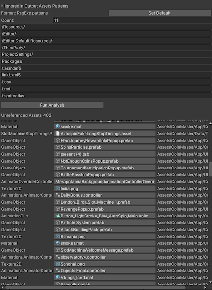

# Dependencies Hunter Unity3D Tool


[](https://opensource.org/licenses/MIT)

##

This tool finds unreferenced assets by scanning all files in your Unity project.

All code combined into one script for easier portability.
So you can just copy-paste [DependenciesHunter.cs](./Packages/DependenciesHunter/Editor/DependenciesHunter.cs) to your project in any Editor folder.

## How it works

At first, it calls
```code
AssetDatabase.GetAllAssetPaths()
```
to form a map of all assets.

Then it uses:
```code
AssetDatabase.GetDependencies
```
to find dependencies for each of those assets. As a result dependencies map is formed.

Then it simply finds all assets which are not presented as a dependency anywhere.
Such assets considered as unused if they aren't marked as to be ignored in this analysis (by a list of RegExp patterns).

### Tools

Dependencies Hunter consists of two editor windows.
Their names are speaking.

- AllProjectAssetsReferencesWindow

It is called from Tools/Dependencies Hunter and lists all assets of your project which it considers as unused.



- SelectedAssetsReferencesWindow

This one called from the context menu by "Find References in Project".
It attempts to find all assets which reference the selected ones. 


## Installation

 1. Through Unity's Package Manager. Use this as git url: `https://github.com/AlexeyPerov/Unity-Dependencies-Hunter.git#upm`. UPM support added via [template](https://github.com/STARasGAMES/Unity-package-repo-setup-template).

 2. Or you can just copy and paste file [DependenciesHunter.cs](./Packages/DependenciesHunter/Editor/DependenciesHunter.cs) inside Editor folder 
