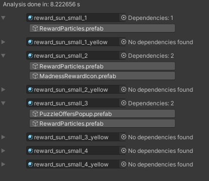
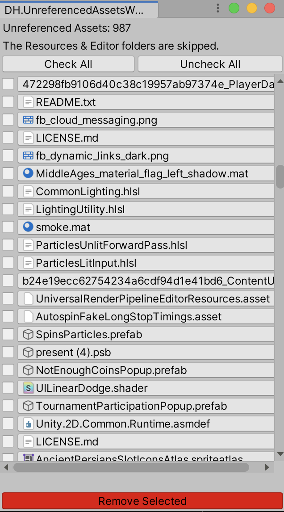

# Dependencies Hunter Unity3D Tool

This tool scans all .meta files in your project and detects direct references between them.

This is by far the simplest way to find unused assets in Unity project.

There are two options to use it:

- Right click on any assets and select "Find .meta references"

It will show you which .meta files reference this asset:

- Click on "Tools/References/Find unreferenced assets" and see the list of all unreferenced assets:

