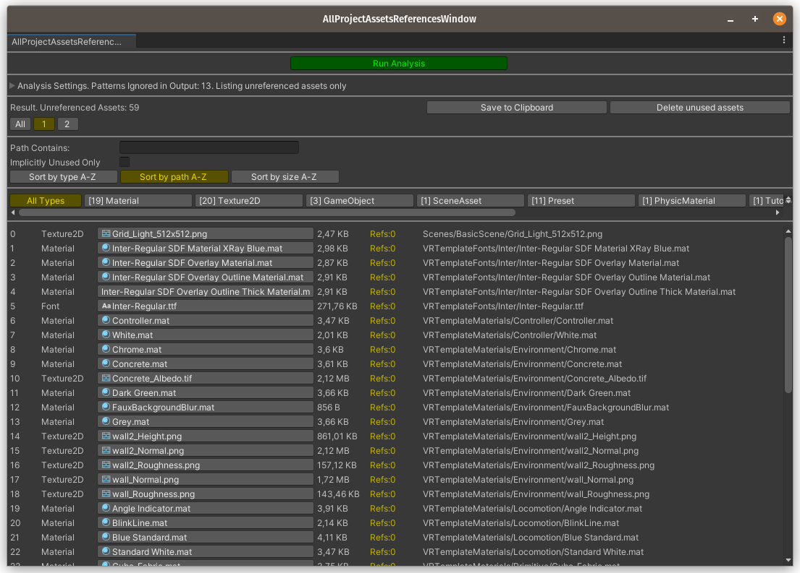
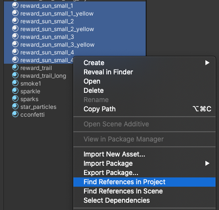
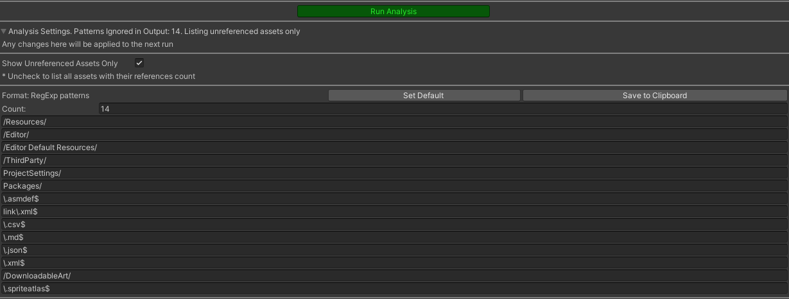
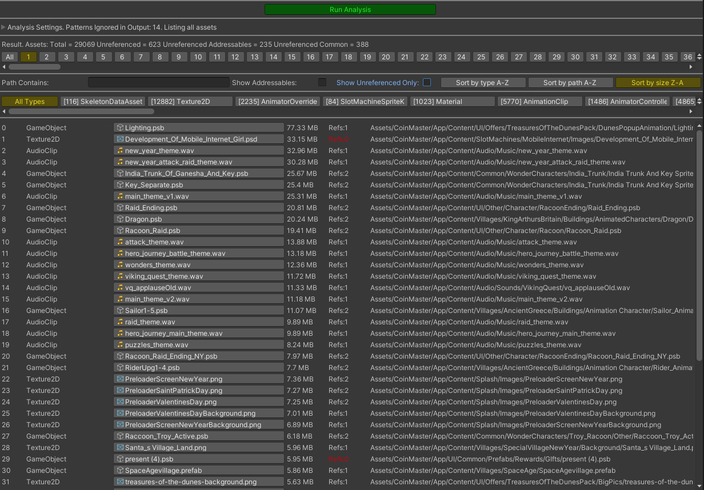

# Dependencies Hunter Unity3D Tool 


[](https://opensource.org/licenses/MIT)
[](https://GitHub.com/Naereen/StrapDown.js/graphs/commit-activity)

##
This tool finds and/or deletes unreferenced assets in Unity project.

All code combined into one script for easier portability.
So you can just copy-paste [DependenciesHunter.cs](./Packages/DependenciesHunter/Editor/DependenciesHunter.cs) to your project in any Editor folder.

# How it works

At first, it calls
```code
AssetDatabase.GetAllAssetPaths()
```
to form a map of all assets.

Then it uses:
```code
AssetDatabase.GetDependencies
```
to find dependencies for each of those assets. As a result dependencies map is formed.

Then it simply finds all assets which are not presented as a dependency within this map.
Such assets considered as unused if they aren't marked as to be ignored in this analysis (by a list of RegExp patterns).

## Addressables

To enable addressables usage uncomment the first line

```code
// #define HUNT_ADDRESSABLES
```
or add HUNT_ADDRESSABLES to the 'Scripting Define Settings' in PlayerSettings

### AssetReference search

By default Addresables AssetReference properties are not considered as a dependency by AssetDatabase.GetDependencies 
and thus are ignored by the tool.

However if you want to treat them as regular references go to Analysis Settings and set 'ScanForAssetReferences' toggle to true.

Defining HUNT_ADDRESSABLES define also adds two more options to the context menu
- [DH] Find References In Project (incl Asset References)
- [DH] Find References In Project (incl Asset References)(Previous Cache)

This options also treat AssetReference as a regular dependency.

# Ways of usage

The tool has two ways to use it. Each has a menu option, and an editor window.

## To list all unused assets in your project..
..click on "Tools/Dependencies Hunter" option which will open the "AllProjectAssetsReferencesWindow" window.

## To then delete the assets you filtered
..click on "Tools/Dependencies Hunter" and then click on Delete Unused Assets



## To list all references towards selected assets..
..select the assets and use a context menu option "[DH] Find References in Project".
It will open the "SelectedAssetsReferencesWindow" window with the results. 

There is also an option "[DH] Find References in Project (Previous Cache)" which will try to use the dependencies database cache from the previous launch and so will perform much faster. 
This might be useful if for example you want to run multiple analysis without changing assets.

| Context Menu  | Result Window |
| ------------- | ------------- |
|  |  |

## Settings

In the Analysis Settings foldout you can set files to be ignored by providing a list of RegExp patterns.
You can also uncheck the 'Show Unreferenced Assets Only' toggle 
to view the list of all your project assets with their references number, files sizes etc.

| Analysis Settings  | Listing all Assets |
| ------------- | ------------- |
|  |  |

## Installation

 1. Through Unity's Package Manager. Use this as git url: `https://github.com/AlexeyPerov/Unity-Dependencies-Hunter.git#upm`. UPM support added via [template](https://github.com/STARasGAMES/Unity-package-repo-setup-template).
 2. Or you can just copy and paste file [DependenciesHunter.cs](./Packages/DependenciesHunter/Editor/DependenciesHunter.cs) inside Editor folder 

## Contributions

Feel free to [report bugs, request new features](https://github.com/AlexeyPerov/Unity-Dependencies-Hunter/issues) 
or to [contribute](https://github.com/AlexeyPerov/Unity-Dependencies-Hunter/pulls) to this project! 

## Other tools

##### Missing References Hunter

- To find missing or empty references in your assets see [Missing-References-Hunter](https://github.com/AlexeyPerov/Unity-MissingReferences-Hunter).

##### Textures Hunter

- To analyze your textures and atlases see [Textures-Hunter](https://github.com/AlexeyPerov/Unity-Textures-Hunter).

##### Editor Coroutines

- Unity Editor Coroutines alternative version [Lite-Editor-Coroutines](https://github.com/AlexeyPerov/Unity-Lite-Editor-Coroutines).
- Simplified and compact version [Pocket-Editor-Coroutines](https://github.com/AlexeyPerov/Unity-Pocket-Editor-Coroutines).
