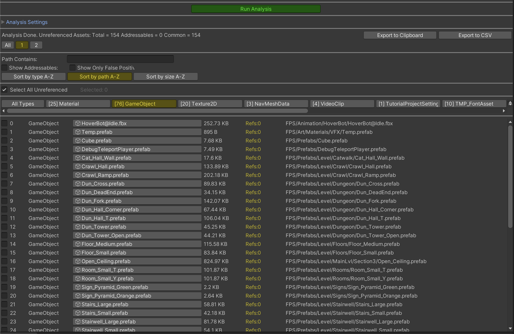
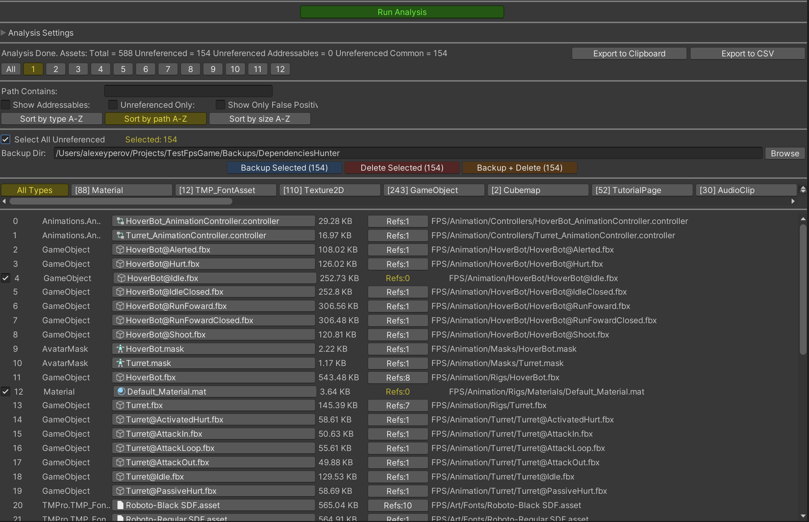
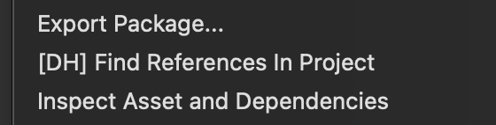
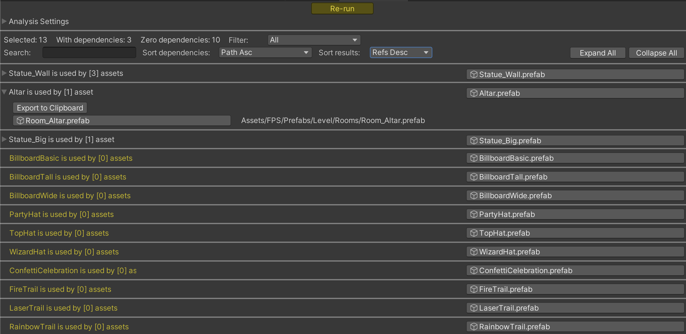
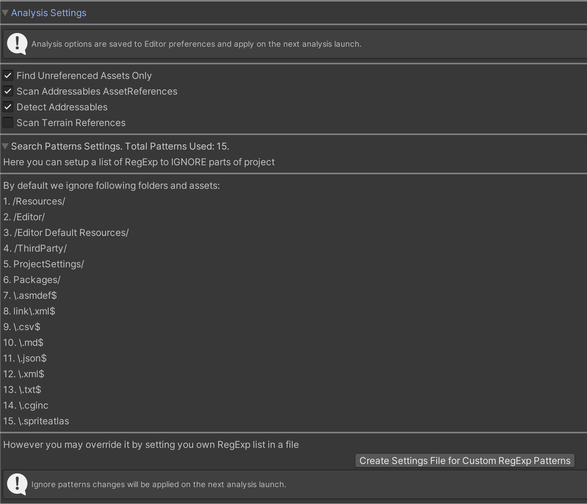
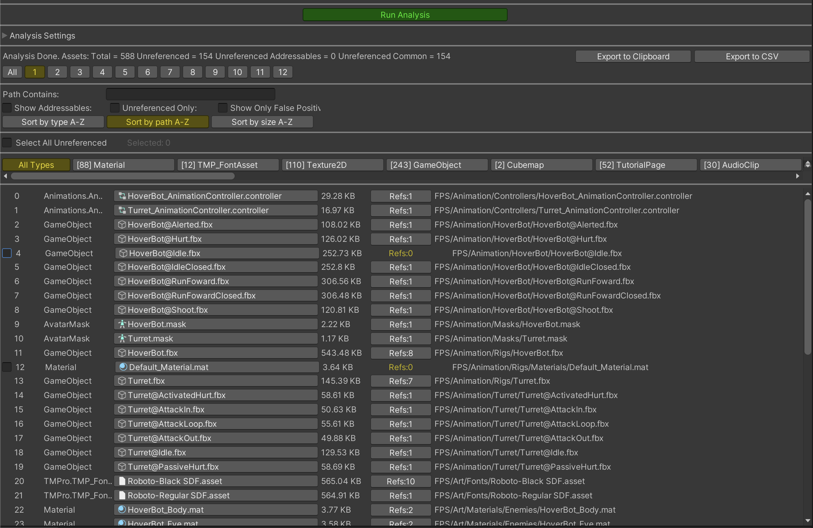

# Dependencies Hunter Unity3D Tool 


[](https://opensource.org/licenses/MIT)
[](https://GitHub.com/Naereen/StrapDown.js/graphs/commit-activity)

##
This tool finds and/or deletes unreferenced assets in Unity project.
It can also list all assets in project and show who reference them.

Addressables and AssetReference detection is also supported. Enable it in tool settings if needed.

All code combined into one script for easier portability.
So you can just copy-paste [DependenciesHunter.cs](./Editor/DependenciesHunter.cs) to your project in any Editor folder.
You can also install it via UPM using link https://github.com/AlexeyPerov/Unity-Dependencies-Hunter.git.


#### If you are interested in MCP for Unity have a look at [Unity-Open-MCP](https://github.com/AlexeyPerov/Unity-Open-MCP) 

Complete list of other tools see in the end of this document.

---

# How it works

At first, it calls
```code
AssetDatabase.GetAllAssetPaths()
```
to form a map of all assets.

Then it uses:
```code
AssetDatabase.GetDependencies
```
to find dependencies for each of those assets. As a result dependencies map is formed.

Then it simply finds all assets which are not presented as a dependency within this map.
Such assets considered as unused if they aren't marked as to be ignored in this analysis (by a list of RegExp patterns).

## What counts as a dependency

The main analysis is based on Unity's `AssetDatabase.GetDependencies`, so it follows the references Unity exposes through asset serialization and import data.

Optional analysis settings can extend this:

- `Scan Addressables AssetReferences` treats serialized Addressables `AssetReference` fields as regular dependencies.
- `Detect Addressables` marks assets registered in Addressables settings and keeps them out of delete eligibility.
- Terrain-data reference scanning can be enabled to catch terrain-related asset links that are easy to miss in regular dependency output.

Please note that runtime-only references are still possible false positives: assets loaded by string path, custom registries, reflection, remote catalogs, or code-generated paths may not be visible to Unity dependency APIs.

## Addressables

To enable addressables detection toggle option 'Detect Addressables'. In that case unreferenced assets which are addressables are not considered as unused by the tool and not shown by default.

### AssetReference search

By default Addressables AssetReference properties are not considered as a dependency by AssetDatabase.GetDependencies 
and thus are ignored by the tool.

However if you want to treat them as regular references go to Analysis Settings and set 'ScanForAssetReferences' toggle to true.
Please note that this will make analysis a little bit longer since it changes the underlying mechanics and requires parsing assets as text.

# Ways of usage

The tool has two ways to use it. Each has a menu option, and an editor window.

## To list all unused assets in your project..
..click on "Tools/Dependencies Hunter" option which will open the "Dependencies Hunter" window.



Here you can analyze project and perform unused assets deletion.
Only assets with zero detected references and not marked as Addressable (if 'Detect Addressables' is enabled) are eligible for deletion.
Use the selection/backup controls in the results window to review assets before applying deletion.



## To list all references towards selected assets..
..select the assets and use a context menu option "[DH] Find References in Project".
It will open the "Selected Assets" window with the results. 

| Context Menu                             | Result Window                                   |
|------------------------------------------|-------------------------------------------------|
|  |  |

## Settings

In the Analysis Settings foldout you can set files to be ignored by providing a list of RegExp patterns.
You can also uncheck the 'Show Unreferenced Assets Only' toggle 
to view the list of all your project assets with their references number, files sizes etc.

Ignore patterns are regular expressions matched against asset paths.
You can create a custom `DependenciesHunterIgnorePatterns.asset` under `Assets/Editor` from the settings foldout, or delete that settings asset to restore the built-in defaults on the next run.

| Analysis Settings                           | Listing all Assets                               |
|---------------------------------------------|--------------------------------------------------|
|  |  |

## Installation

 1. Using Unity's Package Manager via https://github.com/AlexeyPerov/Unity-Dependencies-Hunter.git.
 2. You can also just copy and paste file [DependenciesHunter.cs](./Editor/DependenciesHunter.cs) inside Editor folder 

---

## Contributions

Feel free to report bugs, request new features
or to contribute to this project!

---

## Other tools

##### Unity Open MCP

- To get a complete set of tools to use AI with Unity see [Unity-Open-MCP](https://github.com/AlexeyPerov/Unity-Open-MCP).

##### Unity Scanner

- To analyze the whole project for various issues see [Unity-Scanner](https://github.com/AlexeyPerov/Unity-Scanner).

##### Addressables Inspector

- To analyze addressables layout [Addressables-Inspector](https://github.com/AlexeyPerov/Unity-Addressables-Inspector).

##### Missing References Hunter

- To find missing or empty references in your assets see [Missing-References-Hunter](https://github.com/AlexeyPerov/Unity-MissingReferences-Hunter).

##### Textures Hunter

- To analyze your textures and atlases see [Textures-Hunter](https://github.com/AlexeyPerov/Unity-Textures-Hunter).

##### Materials Hunter

- To analyze your materials and renderers see [Materials-Hunter](https://github.com/AlexeyPerov/Unity-Materials-Hunter).

##### Asset Inspector

- To analyze asset dependencies see [Asset-Inspector](https://github.com/AlexeyPerov/Unity-Asset-Inspector).

##### Editor Coroutines

- Unity Editor Coroutines alternative version [Lite-Editor-Coroutines](https://github.com/AlexeyPerov/Unity-Lite-Editor-Coroutines).
- Simplified and compact version [Pocket-Editor-Coroutines](https://github.com/AlexeyPerov/Unity-Pocket-Editor-Coroutines).

